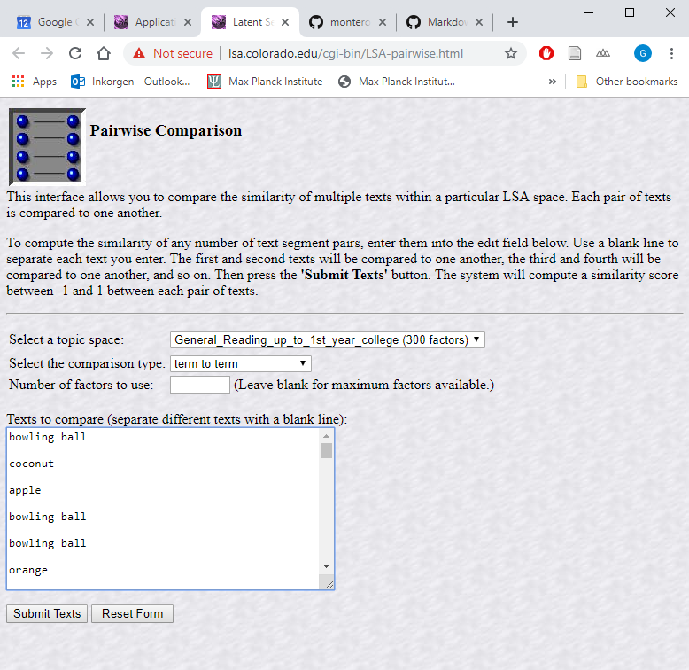
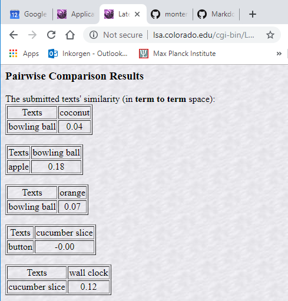

Introduction
============

As part of a critical comment on Hayakawa & Keysar (2018 in *Cognition*), we
want to make the point that assuming that the shape task and the category task
in their Experiment 2 require the "same level of knowledge of the language" 
(p. 11) is problematic. One reason for this is that simple co-occurrence
patterns of words are predictive of semantic similarity, and thus category
similarity, but not of shape similarity. To illustrate this point I wanted
to plot the cosine similarity computed using Latent Semantic Analysis (LSA)
for the shape vs category matches.
LSA is not really state-of-the-art anymore, but it's sufficient to make the
point -- and it has an online tool that can be used by anyone.


```{r setup, include=FALSE}
library(knitr)
library(ggplot2)
library(ggrepel)  # avoids overlapping labels
library(dplyr)
library(tidyr)
knitr::opts_chunk$set(echo = TRUE, fig.height = 3.5)
```


Apply LSA
=========

The stimuli
-----------

```{r}
# The stimuli used in Experiment 2
stim <- read.csv("exp2_stimuli.csv", stringsAsFactors = FALSE)
```

Each trial in Exp 2 consisted of a triad of words. Each such triad is shown as
a row in the data set:

```{r}
head(stim) %>% kable
```

There were two lists with different words, each consisting of 24 trials.

Remarks:

- For each triad, the first two words always constitute the shape match and
the last two words the category match.
- Note that some of the words are repeated across trials, e.g. "TV screen" is
a category match with "wall clock" on row 5, but it is a shape match with
"toast" on row 6.


Save stimuli to right format for LSA
------------------------------------

We want to create a text file that has the required format to use with the
[online LSA tool](http://lsa.colorado.edu/cgi-bin/LSA-pairwise.html) we will use.

Word pairs for which we want to compute pairwise cosine distance need to follow
one another separated by a blank line.

```{r}
## create output file
file.create("LSA_input.txt")
# shape matches
for(row in seq_len(nrow(stim))) {
  cat(stim[row, "w1"], file = "LSA_input.txt", append = TRUE)
  cat("\n\n", file = "LSA_input.txt", append = TRUE)
  cat(stim[row, "w2"], file = "LSA_input.txt", append = TRUE)
  cat("\n\n", file = "LSA_input.txt", append = TRUE)
}
# category matches
for(row in seq_len(nrow(stim))) {
  cat(stim[row, "w2"], file = "LSA_input.txt", append = TRUE)
  cat("\n\n", file = "LSA_input.txt", append = TRUE)
  cat(stim[row, "w3"], file = "LSA_input.txt", append = TRUE)
  cat("\n\n", file = "LSA_input.txt", append = TRUE)
}
rm(row)
```


Apply LSA
---------

Go to http://lsa.colorado.edu/cgi-bin/LSA-pairwise.html and paste the input
data from the previous step ("LSA_input.txt") into the corresponding text field.
It should look something like this:



After clicking "Submit Texts", the output is the following webbage:



For each consecutive pair of words there is a cosine distance. This html file
has been saved to the repository as "LSA_output_raw-html.html".


Cast cosine similarities into convenient data format
---------------------------------------------------

We want to cast the crucial information from the html file into a convenient
format, i.e. into a tabular format.


### Define the format we want to achieve

First, let's create a dataframe with the right format but without the cosine
distances (these we'll add later).

```{r}
# Put shape matches and category matches into one column each
stim$shape <- with(stim, paste(w1, w2, sep = " - "))
stim$category <- with(stim, paste(w2, w3, sep = " - "))
# keep only necessary columns and reshape to long format
cosines <- stim %>%
  select(List, shape, category) %>%
  gather(match_type, word_pair, shape, category)
```

For now the dataframe looks like this (first and last 3 rows):

```{r}
head(cosines, 3)
tail(cosines, 3)
```


### Get the important info from html file

I will apply a brute force approach, reading the html file as text and using
REGEX. (R packages such as `XML` might do this in a more structured way but I
don't know how to use them and for our purposes, regex will do the job.)

First, read the html file line-by-line and put into a data frame consisting of
one single column.

```{r}
lsa_out <- read.delim("LSA_output_raw-html.html", header = FALSE, sep = ",",
                          col.names = "text", stringsAsFactors = FALSE)
# Note that by using sep = "," we're making sure each line in the file becomes
# one line in our data frame
# head(lsa_out)
```

Inspecting the html (in a separate text editor like SublimeText), we see which
rows contain the crucial information, that is, either the words that were
compared or their cosine similarity:
These happen to be all the rows that contain the word "align" in them because
the crucial information appears in a table format.

```{r}
# (NB: Using the pipes with dplyr makes sureusing the pipes with dplyr ensures
# the result is not turned from a dataframe into a vector)
lsa_out <- lsa_out %>%
  filter(grepl("align", text))
head(lsa_out)
```

```{r}
# Now we put each pair of consecutive rows together, so that all info for a
# triad is in the same line:
odd_rows <- -1 + 2 * seq_len(nrow(lsa_out) / 2)
lsa_comb <- data.frame(odd  = lsa_out$text[odd_rows],
                       even = lsa_out$text[odd_rows + 1])
lsa_combined <- with(lsa_comb, paste(odd, even))
rm(odd_rows, lsa_comb)
```


This is already some progress. Now let's remove all the unnecessary markup:


```{r}
# Messy regex, but does the job. Note that we need to take into account:
# 1) The target word sometimes consists of two words ("TV screen");
# 2) Some cosine similarities are NA (marked as "N/A") if the word isn't there.

lsa_clean <- gsub(".*xts.*ER> ([A-Za-z]+ ?[A-Za-z]*)  .*ER> ([A-Za-z]+ ?[A-Za-z]*)<.*([0-9]\\.[0-9]+|N/A)$",
                  "\\2 - \\1,\\3", lsa_combined, perl = TRUE)
# Note that we need to replace the 1st and 2nd word in reversed order to match
# the original order (simply a consequence of how html of tables is parsed but
# the cosine(A,B) = cosine(B,A) so it doesn't matter)
lsa_clean <- data.frame(collapsed = lsa_clean) %>%
  separate(collapsed, c("word_pair", "cosine"), ",")
lsa_clean$cosine <- as.numeric(lsa_clean$cosine)
# head(lsa_clean)
```


### Merge it back to the intended data frame

And finally...

```{r}
cosines <- left_join(cosines, lsa_clean)
head(cosines)
```


Plot the result
===============

```{r}
ggplot(cosines, aes(x = match_type, y = cosine)) +
  geom_jitter(height = 0, width = .1)
```


```{r, fig.height=7, fig.width=8}
# Labels for extreme values
cosines$Labels <- cosines$word_pair
cosines$Labels[with(cosines,
                    match_type == "category" &
                      ! (cosine <= .15 | cosine > .6) )] <- NA
cosines$Labels[with(cosines,
                    match_type == "shape" &
                      ! (cosine <= .01 | cosine > .3) )] <- NA
# plot with labels
ggplot(cosines, aes(x = match_type, y = cosine, label = Labels)) +
  geom_jitter(height = 0, width = .05) +
  geom_text_repel() +
  ylim(-.01, .85) +
  theme_bw()
```

